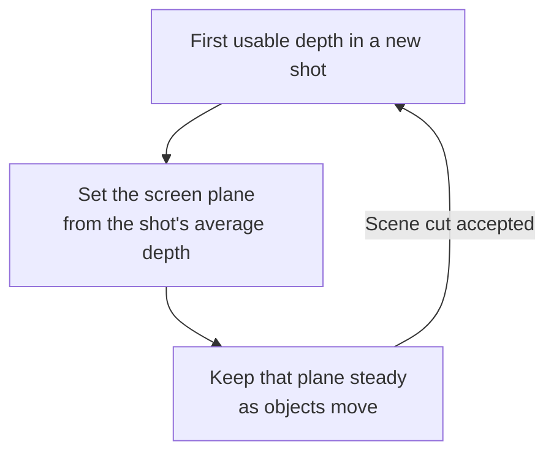

<p align="center">
  
</p>

<h1 align="center">Moonlight 3D</h1>

<p align="center">
  <strong>Everything you love on your PC, now in 3D.</strong><br>
  Watch, play, and work in immersive 3D on your Android XR headset.
</p>

> [!IMPORTANT]
> **The full Sunshine 3D + Moonlight 3D experience currently requires a Windows 11 PC with an NVIDIA GPU.**
> Sunshine 3D does not support AMD or Intel GPUs, software encoding, Linux, or macOS hosts.

<p align="center">
  
</p>

<p align="center">
  Choose where to create 3D, then watch on your headset or connected glasses—or save a 3D video.
</p>

<p align="center">
  <a href="https://github.com/dcatcher9/Apollo-3D"><strong>Set up Sunshine 3D →</strong></a>
  ·
  <a href="#quick-start">Quick start</a>
  ·
  <a href="#build-from-source">Build the APK</a>
  ·
  <a href="./docs/android-xr-sbs.md">XR architecture</a>
</p>

Moonlight 3D is an Android XR streaming client designed and tested with
[Sunshine 3D](https://github.com/dcatcher9/Apollo-3D). It combines Moonlight’s low-latency
streaming foundation with a spatial application library, in-headset session controls, native
side-by-side (SBS) presentation, and optional GPU depth conversion. Create 3D on the Windows PC or
on the headset without requiring game mods, player plug-ins, or application-specific stereo
support.

> **XR-only build:** the application requires Android XR spatial APIs. Samsung Galaxy XR is the
> validated hardware target; the x86_64 build exists for the Android XR emulator.

> **What “content-universal” means:** the AI path can process content visible to the supported
> Windows capture path. Protected or otherwise noncapturable surfaces remain outside the pipeline,
> and monocular depth is an estimate rather than authored stereo geometry.

## Popular use cases

| What you want to do | Best path and payoff |
|---|---|
| **🎬 Watch capturable browser or local video in 3D** | When Windows capture can see the decoded frames, choose Host 3D or Client 3D to convert the player output live |
| **🎮 Turn an existing flat PC game into 3D** | Use the PC GPU with Host 3D or the headset GPU with Client 3D—no game-specific stereo mod or profile required |
| **🖥️ Use a private spatial Windows desktop** | Stay in 2D for maximum text clarity or enable AI depth when useful; the virtual display negotiates landscape or portrait geometry, refresh rate, HDR state, and scale |
| **🎞️ Present native SBS games and media** | Select Raw SBS to preserve the source’s authored left/right views without estimating depth again |
| **⚡ Choose where the AI runs** | Move between Host 3D and Client 3D while keeping the same app library, controls, audio, and input loop |
| **👓 Drive tethered AR glasses directly** | Use Sunshine 3D’s local presenter for 2D or host-generated full SBS while bypassing network encode/decode |

## PC, Android XR, and AR glasses

The product boundary is intentionally simple: Sunshine 3D owns the PC; Moonlight 3D owns the
Android XR experience; directly attached AR glasses stay on the PC path.

| Where you want to watch | What you need | What Sunshine 3D does |
|---|---|---|
| **Galaxy XR headset** | Sunshine 3D on the PC + Moonlight 3D on the headset | Streams 2D or stereo, with audio and input |
| **PC-connected AR glasses** | Sunshine 3D + a supported glasses display | Presents 2D or Host 3D directly on the glasses |
| **A saved 3D video** | Sunshine 3D + the approved FFmpeg tools | Converts a local file to SBS for later playback |

Direct AR output is a Sunshine 3D feature, not a Moonlight 3D client path. It is currently
video-only and supports 1920×1080 2D or 3840×1080 host-generated full SBS on an approved,
non-primary, non-cloned display. A remote XR virtual-display session that is connecting, active,
or retained for resume takes priority over the local glasses presenter. Windows audio remains on
its current default endpoint. See the
[Sunshine 3D local-glasses guide](https://github.com/dcatcher9/Apollo-3D/blob/master/docs/sbs-local-ar-glasses.md).

## Conversion and passthrough modes

| Mode | Where 3D is produced | Use when |
|---|---|---|
| **2D** | No 3D processing | You want a direct mono SceneCore panel with the lowest processing cost |
| **Client 3D** | Galaxy XR GPU using original ZipDepth Base with FP16-stored weights | The host sends mono video and the headset should create depth |
| **Raw SBS** | The source creates both views; Moonlight 3D splits them | The source renders packed left/right views inside a Virtual Display-backed session, which Raw SBS requires |
| **Host 3D** | Windows CUDA/TensorRT-capable NVIDIA GPU | Sunshine 3D should convert mono content before encoding |

Raw SBS presents stereo content that already exists; it does not estimate depth. Full packing
sends two complete eye views at double width, while Half packing keeps the selected stream width
and gives each eye half of its horizontal pixels.

Host 3D and Client 3D are the real-time 2D-to-3D paths. Raw SBS preserves stereo supplied by the
source, while 2D bypasses conversion entirely.

Client 3D uses original ZipDepth Base and automatically adapts to the selected stream's aspect
ratio, including portrait. There is no model selector. See the
[XR architecture](./docs/android-xr-sbs.md) for the current contracts and
[Client SBS evaluation](./docs/client-sbs-evaluation.md) for device measurements.

## Quick start

1. Install and configure [Sunshine 3D](https://github.com/dcatcher9/Apollo-3D) with its bundled
   SudoVDA driver on the Windows PC, then run the host with administrator privileges.
2. Open `https://localhost:47990` on the PC. No sign-in is required on this PC or an allowed
   trusted local network; credentials apply only if WAN Web UI access is explicitly enabled.
   Keep the page ready for the **Enter PIN** pairing card.
3. [Build and install](#build-from-source) the current arm64 Moonlight 3D APK, or install a
   packaged build when one is available, on Galaxy XR.
4. Put the PC and headset on the same network for initial discovery.
5. Open Moonlight 3D and select the discovered PC, or add its IP address or hostname manually.
6. Select **Pair**. Moonlight 3D displays a four-digit PIN.
7. Enter that PIN in Sunshine 3D’s
   **Enter PIN** card.
8. Open the application library and launch **Virtual Display** for the complete resolution and
   Raw SBS workflow, or launch another configured application.
9. Start in **2D**, then select Client 3D, Raw SBS, or Host 3D from the in-headset dock.

A regular Sunshine or Apollo host can provide an ordinary mono stream for both 2D and Client 3D,
including standard pairing, launch, resume, and end-session behavior. Raw SBS is available when the
selected launch is backed by a compatible virtual display. Sunshine 3D is required for Host 3D,
live host quality controls, and host depth telemetry/debugging.

**Use virtual display only while streaming** is enabled by default in **Global Settings →
Streaming defaults** and applies on the next connection to a supporting Sunshine 3D host. For a
virtual-display session, it disables ordinary PC displays in Windows so applications open on the
streamed desktop. Approved AR-glasses displays that need scanout remain active, and the host
automatically keeps the shared Windows cursor on the virtual display. Turn the setting off and
reconnect to keep ordinary PC displays active. The previous display setup is restored on disconnect.
This is the same signed-in Windows desktop, with shared applications, focus, and cursor;
physical-display streams are unaffected. See the
[virtual-desktop guide](https://github.com/dcatcher9/Apollo-3D/blob/master/docs/virtual-desktop.md)
for application placement and recovery behavior.

## Stable 3D within each scene

Host 3D and Client 3D use the current Depth Coordinate V2 mapping, with different depth models
and GPU pipelines. Client 3D calibrates each ZipDepth aspect graph to that shared coordinate and
uses a fixed stereo strength. Its zero-disparity screen plane comes from the arithmetic mean of
the raw depth field, latched when usable depth first establishes a shot and on accepted scene cuts.
It stays fixed as objects move within the scene.



Client 3D reuses valid geometry for sufficiently similar content and presents the current color
with it. Invalid or collapsed depth produces flat output. This reduces unnecessary inference while
keeping depth failures from applying invalid geometry to the current image.

The models can still produce different detail and artifacts. Host 3D also owns foreground-window
and subtitle plane conditioning; these are not part of Client 3D. The
[XR architecture](./docs/android-xr-sbs.md#fixed-client-sbs-depth-coordinate-v2) owns the live client
geometry, and the [client–host parity guide](./docs/client-host-sbs-parity.md) distinguishes current
behavior from historical experiments.

## Why this pair stands out

Its distinguishing scope is one coordinated workflow spanning flat streaming, authored SBS,
host-side AI conversion, headset-side AI conversion, remote Android XR interaction, and direct
local AR-glasses presentation.

| Workflow category | Scope | Main tradeoff |
|---|---|---|
| **Sunshine 3D + Moonlight 3D** | Capturable Windows content can use AI depth on the PC or Galaxy XR; authored SBS is preserved for remote Android XR, while Sunshine 3D can present host-generated 3D directly to local glasses | Validated around Windows 11, NVIDIA, and Galaxy XR; inferred geometry is scene-dependent |
| **Native stereo only** | The application or media supplies authored eye views to a compatible local or streaming stack | Preserves authored binocular geometry and avoids monocular estimation when well authored, but only where the source explicitly supplies stereo |
| **Media-only conversion** | A player or preprocessing tool converts video for file- or player-oriented output | Well-scoped for video, but not a general interactive desktop/game workflow |
| **Local glasses-only conversion** | A PC converter presents supported content directly to attached glasses | No network round trip, but no remote Android XR experience |
| **Conventional flat streaming** | Games, video, and desktop stay mono across a remote video, audio, and input loop | No stereo depth; avoids AI-depth processing cost |

Individual products vary; this compares workflow scope rather than claiming every implementation
in a category behaves identically. Native stereo remains preferable when accurate authored eye
views are available.

## Main features

| Feature | What it provides |
|---|---|
| **In-headset stream dock** | Switches among 2D, Client 3D, Raw SBS, and Host 3D; keeps Settings, Cinema, Library, Stats, and End session within reach. Debug builds also offer Dump 3D |
| **Cinema backgrounds** | A screen size/position preset with Black, System environment, or Passthrough choices; change the background while staying in Cinema |
| **Per-mode quality** | Independent resolution, frame-rate ceiling, and bitrate choices for every viewing mode, with shared codec, HDR, range, pacing, and audio settings |
| **Landscape and portrait source sizes** | Global Settings offers 36 presets, including desktop, ultrawide, phone, and tablet dimensions. In-session mode panes keep the six desktop/ultrawide sizes and their portrait counterparts, preserving other inherited sizes as Custom |
| **Adaptive refresh behavior** | Selectable 30, 60, 72, 90, and 120 FPS ceilings; the live stream can follow a lower headset display rate and recover without changing the selected ceiling |
| **Client GPU depth** | Original ZipDepth Base short-384 aspect graphs using a native LiteRT/OpenCL/GLES path—no NPU or CPU fallback |
| **Stable scene geometry** | Calibrated raw-depth coordinates, fixed Client 3D strength, a screen plane held for each shot, and validity-checked reuse of geometry for similar content |
| **Sunshine 3D integration** | Session-scoped Virtual Display launches, negotiated resolution/FPS/HDR, Host 3D, Raw SBS transport, application library, session resume/end controls, and clipboard sync |
| **Virtual desktop focus** | The default virtual-display-only preference directs Windows apps to the streamed desktop and automatically keeps the shared cursor there when an approved AR display remains active |
| **Moonlight input and audio** | Gamepad, mouse, keyboard, touchpad, rumble, stereo/5.1/7.1 audio, host-audio controls, and client loudness boost with a soft limiter |
| **Live diagnostics** | Stream, decoder, network, CPU/GPU load, Client 3D depth health, and supported Sunshine 3D host telemetry with trend charts; client detail sampling and the host subscription stop when Stats closes |
| **Connection tools** | Automatic host discovery, manual IP/hostname entry, secure PIN pairing, Wake-on-LAN, and network testing |

Codec choices include Auto, AV1, HEVC, and H.264. Available geometry, frame rate, HDR, and codec
combinations still depend on the host encoder, network, and Galaxy XR decoder limits. Phone and
tablet presets describe the Windows source dimensions; Moonlight 3D remains an XR-only app.

Quality changes use live updates when the host and decoder support them, or **Apply & reconnect**
when a restart is required. Entering or leaving Raw SBS Full packing and changing Full/Half during
Raw SBS require a reconnect. Current Sunshine 3D hosts negotiate these transitions with the client.

Host Stats performance measurements require diagnostics to be enabled on Sunshine 3D. Opening
Stats in the headset does not turn host diagnostics on.

## Requirements

- An Android XR device with the spatial API; Samsung Galaxy XR is the validated target.
- The arm64-v8a APK for physical hardware. The x86_64 variant is emulator-only.
- A reachable GameStream-compatible host. Use Sunshine 3D for the complete paired feature set.
- A shared local network for automatic discovery, or a manually entered IP/hostname for any
  securely reachable host.

Client 3D runs on the Galaxy XR GPU. It has no NPU or CPU inference fallback; if GPU depth is
unavailable, presentation remains usable as flat output.

## Install on Galaxy XR

Packaged builds appear on
[Moonlight 3D releases](https://github.com/dcatcher9/moonlight-android/releases) when available.
Choose the `nonRoot_game` arm64-v8a artifact for Galaxy XR. If that page has no suitable build for
the revision you need, use the source-build steps below.

## Build from source

Moonlight 3D uses the Gradle 9.7.1 wrapper, Android Gradle Plugin 9.3.2, Android SDK 37.0,
JDK 17–25 (JDK 25 is the development standard), and Android NDK `27.3.13750724`.
Set `JAVA_HOME` to a supported JDK before running Gradle. The app targets Android API 34, requires
API 24 or later plus the XR spatial feature, and compiles Java sources at Java 11 compatibility.
Declared versions live in [app/build.gradle](./app/build.gradle), [build.gradle](./build.gradle),
and the [Gradle wrapper configuration](./gradle/wrapper/gradle-wrapper.properties).

`nonRoot_game` is the sole distribution, with arm64-v8a for Galaxy XR and x86_64 for the XR emulator.
The unsupported Android 7 root APK and its privileged input helper have been removed. The existing
application IDs and `nonRoot_game` task names are unchanged, so update-installs preserve user data.

Before installing to Galaxy XR, enable Developer options and Wireless debugging on the headset,
connect it through Android SDK Platform Tools, and confirm that it appears in `adb devices`.

```powershell
git clone --recurse-submodules https://github.com/dcatcher9/moonlight-android.git
Set-Location moonlight-android

# Create local.properties with sdk.dir=<your Android SDK path>.
.\gradlew.bat :app:assembleNonRoot_gameDebug

# Update-install to the connected physical headset.
.\gradlew.bat :app:installNonRoot_gameDebug
```

Gradle writes the physical-headset APK under `app/build/outputs/apk/`.
The install task uses an update-install. Pairings and preferences are preserved only when updating
the same application ID with a compatible signing key; this does not migrate data from an older
name/package or a differently signed build. Do not run
`connectedNonRoot_gameDebugAndroidTest` against a personal headset: Android’s connected-test
workflow uninstalls the target package and erases preferences, certificates, pairings, and
profiles. Use a disposable emulator, or follow the data-preserving procedure in
[Client SBS evaluation](./docs/client-sbs-evaluation.md).

For an existing checkout, run `git submodule update --init --recursive` before building. Run
`.\gradlew.bat :app:testNonRoot_gameDebugUnitTest` for the main flavor's JVM tests, which do not
require a headset. See [Android test setup](./android_test_setup.md) for focused test commands.

## Documentation

| Topic | Guide |
|---|---|
| XR presentation and mode contracts | [Android XR SBS architecture](./docs/android-xr-sbs.md) |
| Virtual desktop and display restoration | [Sunshine 3D virtual desktop](https://github.com/dcatcher9/Apollo-3D/blob/master/docs/virtual-desktop.md) |
| Host/client 3D behavior | [Client–host SBS parity](./docs/client-host-sbs-parity.md) |
| Client 3D measurement workflow | [Client SBS evaluation](./docs/client-sbs-evaluation.md) |
| JVM test setup | [Android tests](./android_test_setup.md) |
| Host/client boundary tests | [Workflow tests](./tools/workflow-tests/README.md) |
| Depth-model provenance | [Model sources](./tools/model-sources/README.md) |

## Project lineage and credits

Moonlight 3D was previously named Artemis and Moonlight Noir. It is an Android XR-focused fork of
[Moonlight for Android](https://github.com/moonlight-stream/moonlight-android), designed to pair
with Sunshine 3D while retaining the Moonlight protocol and historical `com.limelight` package
lineage.

Original Moonlight Android authors include
[Cameron Gutman](https://github.com/cgutman),
[Diego Waxemberg](https://github.com/dwaxemberg),
[Aaron Neyer](https://github.com/Aaronneyer), and
[Andrew Hennessy](https://github.com/yetanothername).

## License

Moonlight 3D is licensed under GPLv3. See [LICENSE.txt](./LICENSE.txt). The bundled depth model and
LiteRT runtime retain their own notices and licenses in the
[model notice directory](./app/src/nonRoot_game/assets/third_party/client_sbs_models/).
